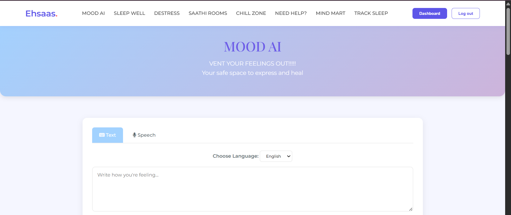
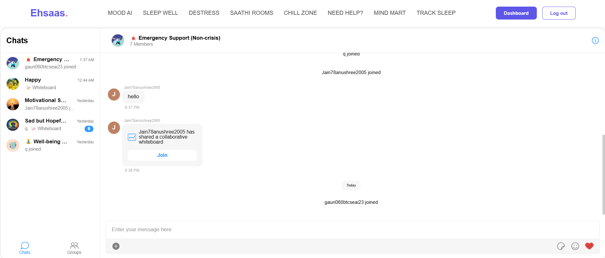
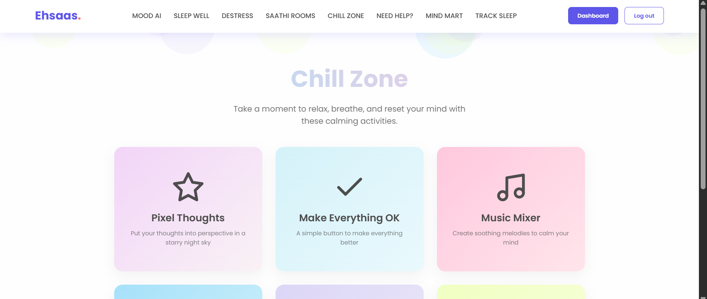
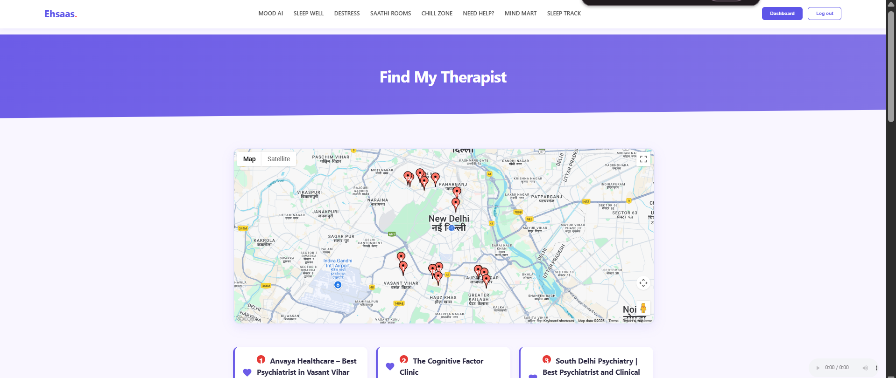
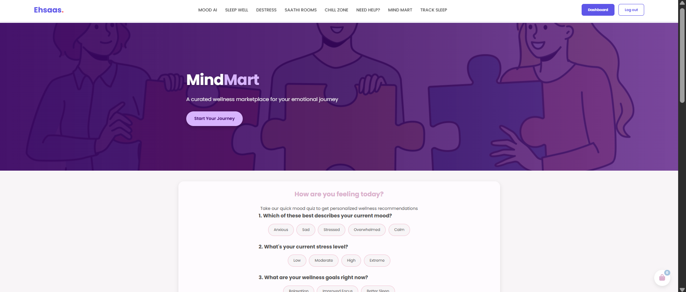

# Ehsaas: Emotional First-Aid Platform

---

## Overview

**Ehsaas** is a comprehensive emotional first-aid platform designed to provide users with tools for managing mental well-being. It offers interactive features like **MoodAI** for emotional analysis, **Saathi Rooms** for anonymous peer support, and **Mind Mart** for personalized book recommendations. Ehsaas aims to create a supportive, engaging, and accessible mental health environment, helping users cope with challenges such as stress, anxiety, and sleep disturbances.

---

## Features

### 1. **MoodAI**

- **MoodAI** assesses your emotional state through text or voice inputs.
- Based on the results, it suggests personalized wellness activities, including:
  - **Guided Meditation**
  - **Breathing Exercise**
  - **Gratitude Journal**
  - **Anger Release**
  - **Mood Tracker**
  - **Positive Affirmations**
  - **Nature Walk**
  - **Art Therapy**
  - **Mood-Boosting Music**
  - **Muscle Relaxation**
  - **Laughter Exercise**

### 2. **Saathi Rooms**

- **Saathi Rooms** offers anonymous group chatrooms to connect with people experiencing similar emotions.
- Features:
  - **React on Messages**: Users can express their feelings by reacting to messages.
  - **Reply in Threads**: Engage in meaningful conversations by replying in message threads.
  - **Leave Groups**: Users can leave chatrooms when they no longer wish to participate.
  - **Collaborative Whiteboard**: All users in a room can draw together on the same whiteboard to express themselves creatively.

### 3. **Chill Zone**

- **Chill Zone** offers fun activities designed to help you relax and reduce stress:
  - **Pixel Thoughts**: Visualize your thoughts in a starry night sky.
  - **Make Everything OK**: A simple button that helps you feel better with a click.
  - **Music Mixer**: Create soothing melodies to calm your mind.
  - **Rainy Mood**: Listen to calming rain sounds to enhance focus.
  - **Fidget Spinner**: Play with a virtual fidget spinner to release stress.
  - **Draw Canvas**: Express yourself through free-form drawing.

### 4. **Find My Therapist**

- Helps users find nearby therapists based on their location.
- Users can book appointments with mental health professionals for personalized care.
- Provides easy access to mental health resources when professional help is needed.

### 5. **Mind Mart**

- **Mind Mart** is a wellness marketplace where users can take a quiz to get personalized recommendations for emotional well-being products:
  - **Mood Quiz**: Take a short quiz to receive wellness product suggestions.
  - **Personalized Products**: Based on your mood, receive recommendations for books, journals, and more.
  - **Example Products**:
    - **Mindfulness Journal**: ₹499.00
    - **Anxiety Relief Essential Oil Blend**: ₹449.00
    - **Healing Through Art Course**: ₹999.00
    - **Sleep Sound Machine**: ₹1249.00

### 6. **Sleep & Healing**

- **Sleep Stories**: A collection of bedtime stories narrated by popular voices.
- **Sleep Meditations**: Guided meditations for restful sleep.
- **Music for Sleep**: Calming sounds to support restful sleep.
- **Sleep Tracking**: Monitor your sleep patterns to improve your sleep quality.
- **Kids Bedtime Stories**: Stories for both children and adults to help you unwind.

### 7. **Destress - Wellness Tools**

- **Stress and Anxiety Relief**: Evidence-based techniques to reduce anxiety and stress.
- Features include:
  - **Breathing Exercises**
  - **Grounding Exercises**
  - **Quick Relief Programs**
  - **Podcast: Overcome Stress and Anxiety** by Dr. Julie Smith

### 8. **Audio/Video Diary**

- **Audio/Video Diary**: Users can record audio or video diary entries and save them locally.
- **Personalized Dashboard**: View user statistics and track your mental health journey.

---

## Screenshots

### MoodAI

### Saathi Rooms

### Chill Zone

### Find My Therapist

### Mind Mart

---

## Tech Stack

- **Frontend:** HTML, CSS, JavaScript
- **Backend:** Python (AI logic and APIs)
- **AI/ML:** HuggingFace Transformers for mood analysis
- **Authentication & Storage:** Firebase Auth, Firestore, Firebase Storage
- **Real-Time Chat:** Firebase + CometChat (group mode)
- **Other APIs:** Google Maps API

---

## License

This project is not licensed. Feel free to use or modify the code as needed.

---

## Team

- Ananya Bajpai
- Anushree Jain
- Gauri Aggarwal
- Pearl Vashistha

---

## Acknowledgements

- Firebase, CometChat, HuggingFace, and Google Maps APIs for powering key functionalities.
- Special thanks to everyone who tested and provided feedback.
